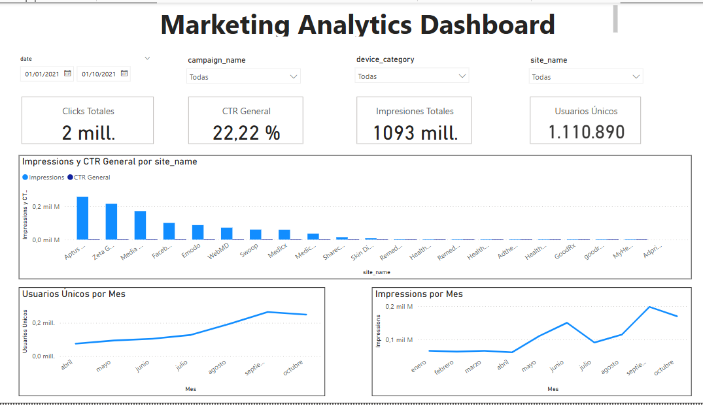
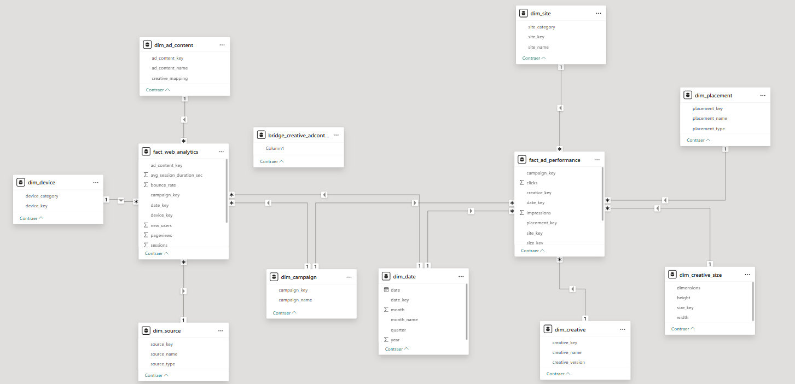

# Dashboard Analytics - Marketing Analytics ETL System

## Overview
This project contains a complete ETL (Extract, Transform, Load) system for marketing analytics data, designed to process advertising performance data and web analytics to generate actionable insights.



## Project Structure
```
DashboardAnalytics/
├── src/                        # Source code
│   ├── etl/                    # ETL scripts
│   │   ├── extract/            # Data extraction modules
│   │   ├── transform/          # Data transformation modules
│   │   ├── load/               # Data loading modules
│   │   └── utils/              # Utility functions
│   └── config/                 # Configuration files
├── data/                       # Data directory
│   ├── raw/                    # Raw data sources
│   │   ├── google_analytics/   # Web analytics data
│   │   └── rfi/                # Advertising performance data
│   └── dimensional/            # Kimball star schema
├── docs/                       # Documentation
│   ├── data_dictionary.csv     # Data dictionary
│   ├── powerbi_setup.md        # Power BI setup guide
│   ├── api_docs.md             # API documentation
│   └── data_model.md           # Data model documentation
├── tests/                      # Test files
├── dashboards/                 # Dashboard files
│   └── Marketingdata.pbix      # Power BI dashboard
├── requirements.txt            # Python dependencies
├── .gitignore                  # Git ignore rules
├── README.md                   # This file
└── assets/                     # Images and static files
    ├── dashboard.png           # Dashboard screenshot
    └── kimball_star_model.png  # Data model diagram
```

## Dashboard Features

### Interactive Marketing Analytics Dashboard
The Power BI dashboard (`dashboards/Marketingdata.pbix`) provides comprehensive insights into marketing performance:

**Key Sections:**
- **Performance Overview**: High-level KPIs and trends
- **Site Performance**: Performance metrics by advertising site
- **Creative Performance**: Ad creative effectiveness analysis
- **Device Analysis**: Performance across different devices
- **Time Series Analysis**: Trend analysis and seasonality
- **Geographic Performance**: Regional performance insights

**Interactive Features:**
- Drill-down capabilities from summary to detailed views
- Cross-filtering between different dimensions
- Dynamic date range selection
- Export functionality for reports
- Real-time data refresh capabilities


## Data Model Architecture

### Kimball Star Schema Implementation
The dimensional model follows the Kimball methodology for data warehousing, providing a robust foundation for analytics:



#### **Dimension Tables (Slowly Changing Dimensions)**
1. **Date Dimension**: Temporal analysis with fiscal periods
2. **Site Dimension**: Advertising site information with SCD Type 2
3. **Creative Dimension**: Ad creative details with version tracking
4. **Device Dimension**: Device type and platform information
5. **Geographic Dimension**: Location-based analysis
6. **Campaign Dimension**: Campaign hierarchy and metadata
7. **User Dimension**: User behavior and segmentation
8. **Channel Dimension**: Marketing channel classification
9. **Product Dimension**: Product catalog and categorization

#### **Fact Tables**
1. **Advertising Facts**: Impressions, clicks, CTR, spend metrics
2. **Web Analytics Facts**: Sessions, users, pageviews, conversions

#### **Bridge Tables**
- **Site-Creative Bridge**: Many-to-many relationships
- **Campaign-Site Bridge**: Campaign hierarchy management
- **User-Session Bridge**: User journey tracking

### **Slowly Changing Dimensions (SCD)**
The system implements SCD Type 2 for critical dimensions:
- **Site Dimension**: Tracks changes in site configuration
- **Creative Dimension**: Version control for ad creatives
- **Campaign Dimension**: Campaign evolution tracking

**Benefits:**
- Historical data preservation
- Audit trail for changes
- Accurate point-in-time analysis
- Compliance with data governance

## ETL Pipeline Architecture

### **Extract Phase**
```
Raw Data Sources → Data Extraction → Initial Validation
├── PGD Dataset 1: Advertising performance data
└── PGD Dataset 2: Web analytics data
```

**Extraction Modules:**
- `src/etl/extract/extract_and_clean.py`: Main extraction orchestrator
- Automated data quality checks
- Incremental extraction support
- Error handling and retry logic

### **Transform Phase**
```
Cleaned Data → Dimensional Model → Data Enrichment
├── Data Standardization
├── Business Logic Application
├── Dimension Creation
└── Fact Table Population
```

**Transformation Modules:**
- `src/etl/transform/create_dimensions.py`: Dimension table creation
- `src/etl/transform/create_facts.py`: Fact table population
- SCD Type 2 implementation
- Data quality transformations

### **Load Phase**
```
Dimensional Model → KPI Calculation → Report Generation
├── KPI Computation
├── Performance Metrics
├── Analysis Reports
└── Dashboard Updates
```

**Loading Modules:**
- `src/etl/load/calculate_kpis.py`: KPI calculation engine
- `src/etl/load/generate_analysis_report.py`: Report generation
- Real-time dashboard updates
- Data mart population

## Complete Project Setup and Execution Guide

### Prerequisites
Before starting, ensure you have the following installed:
- Python 3.8 or higher
- Git
- Power BI Desktop (for dashboard viewing)
- Text editor or IDE (VS Code, PyCharm, etc.)

### Step 1: Clone and Navigate to Project
```bash
# Clone the repository
git clone <repository-url>
cd DashboardAnalytics

# Verify you're in the correct directory
dir
# You should see: src, data, docs, tests, etc.
```

### Step 2: Set Up Python Environment
```bash
# Check Python version (should be 3.8+)
python --version

# Upgrade pip to latest version
python -m pip install --upgrade pip

# Create virtual environment (recommended)
python -m venv venv

# Activate virtual environment
# On Windows:
venv\Scripts\activate
# On macOS/Linux:
source venv/bin/activate
```

### Step 3: Install Dependencies
```bash
# Install project dependencies
pip install -r requirements.txt

# Install development dependencies (optional)
pip install pytest pytest-cov black flake8 mypy pre-commit

# Install project in editable mode
pip install -e .
```

### Step 4: Set Up Development Environment (Optional)
```bash
# Set up pre-commit hooks
pre-commit install
```

### Step 5: Verify Project Structure
```bash
# Run structure tests to verify everything is in place
python -m pytest tests/ -v

# Expected output: All tests passed
```

### Step 6: Prepare Data Files
Ensure the raw data files are in the correct locations:
```
data/raw/google_analytics/
├── Raw GA Data.csv
└── Raw GA Data_202504.xlsx

data/raw/rfi/
└── RFI.csv
```

### Step 7: Run the ETL Pipeline
```bash
# Navigate to the ETL directory
cd src/etl

# Run the complete ETL process
python run_full_etl.py

# Expected output: Processing logs and success messages
```

### Step 8: Verify Output Files
After ETL completion, check the generated files:
```bash
# Check dimensional model files
dir data\dimensional

# Check logs
dir logs
```

### Step 9: Open Power BI Dashboard
1. Open Power BI Desktop
2. Open the file: `dashboards/Marketingdata.pbix`
3. Refresh data connections if needed
4. Explore the dashboard sections

### Step 10: Run Tests (Optional)
```bash
# Run all tests
python -m pytest tests/ -v

# Run tests with coverage
python -m pytest tests/ --cov=src --cov-report=html
```

## What the ETL Does

### Data Sources
- **PGD Dataset 1**: Advertising performance metrics (impressions, clicks, CTR)
- **PGD Dataset 2**: Web traffic and user behavior data

### Processing Steps
1. **Extract & Clean**: Load and clean raw data from the two PGD datasets
2. **Validate**: Check data quality and consistency
3. **Transform**: Create dimensional model (Kimball star schema)
4. **Load**: Generate fact and dimension tables
5. **Calculate KPIs**: Compute key performance indicators
6. **Generate Reports**: Create analysis reports and insights

### Output Files
- **Dimensional Model**: 9 dimension tables + 2 fact tables
- **KPIs**: Summary metrics, site performance, creative performance
- **Analysis Report**: Executive summary with recommendations

## Key Metrics
- **CTR (Click-Through Rate)**: 0.22%
- **Total Impressions**: 108,839,004
- **Total Clicks**: 237,336
- **Total Sessions**: 135,765
- **Total Users**: 111,089

## Power BI Integration
The project includes a Power BI dashboard (`dashboards/Marketingdata.pbix`) that connects to the generated dimensional model for interactive analysis.


## Technical Details
- **Data Model**: Kimball star schema with SCD Type 2
- **ETL Framework**: Custom Python scripts with modular design
- **Data Quality**: Automated validation and cleaning
- **Logging**: Comprehensive execution logs
- **Scalability**: Modular design for easy extension
- **Performance**: Optimized for large datasets

## Documentation
- `docs/data_dictionary.csv`: Complete data dictionary in CSV format
- `docs/powerbi_setup.md`: Power BI setup and usage guide
- `docs/api_docs.md`: API and module documentation
- `docs/data_model.md`: Detailed data model documentation
- Logs in `logs/`: Execution history and debugging


## Testing
Run tests to ensure data quality and ETL process integrity:
```bash
python -m pytest tests/
```

